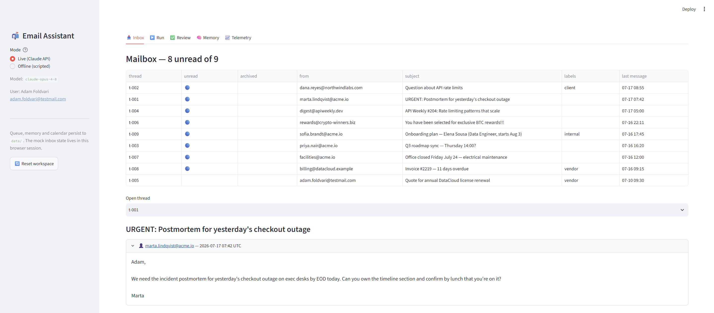
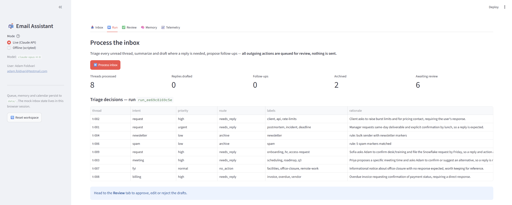
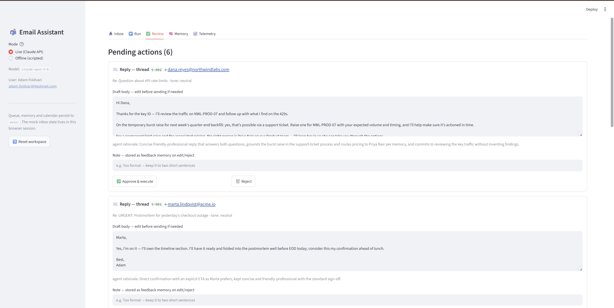
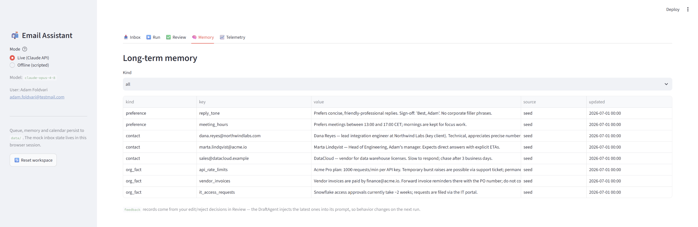
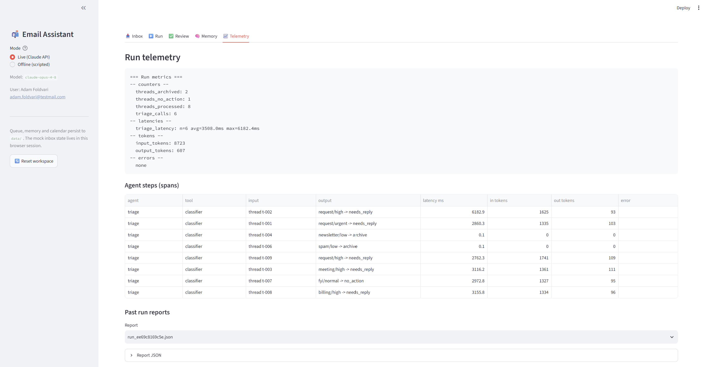
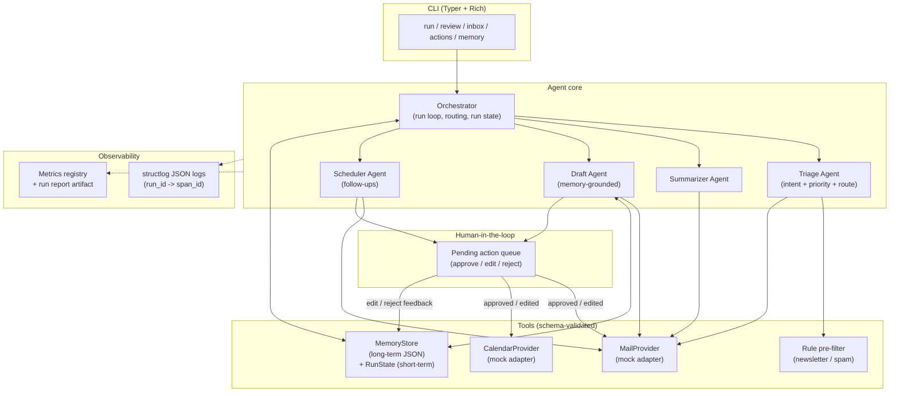

# Agentic Email Assistant

A prototype productivity copilot that manages an inbox autonomously — reads and
triages email, summarizes threads, drafts contextual replies and schedules
follow-ups — while keeping a human in the loop for every outgoing action and
evolving its behavior over time through memory and feedback.

Built as an orchestrator + worker-agent system on the Anthropic Claude API,
with schema-validated structured I/O at every boundary and built-in
observability (structured logs, traces, metrics).

---

## What it does

- **Triage**: classifies every unread thread (intent, priority, labels) and
  routes it — reply needed / follow-up / archive / keep-and-label. Obvious
  bulk mail (newsletters, spam) is caught by a deterministic rule pre-filter
  at **zero API cost**.
- **Summarize**: condenses multi-message threads into a structured summary
  (TL;DR, key points, open questions, action items with owners).
- **Draft**: writes replies in the user's voice, grounded in long-term memory
  — tone preferences, facts about the contact, org facts, and past feedback.
  Missing information becomes a "will follow up" line, never an invented fact.
- **Schedule**: proposes reminders/events, and detects threads where the user
  sent the last message and has been waiting too long for an answer.
- **Human-in-the-loop**: every outgoing action lands in a persistent pending
  queue. The user approves, edits or rejects each one — only then does
  anything execute.
- **Learns from feedback**: edits and rejections are written back into
  long-term memory and injected into future drafting prompts, so corrections
  change behavior on the very next run.

## Quick start

Requirements: Python 3.11+, an Anthropic API key (only for live mode).

```powershell
python -m venv .venv
.venv\Scripts\python.exe -m pip install -e ".[dev]"
copy .env.example .env          # then put your ANTHROPIC_API_KEY into .env
```

**See it work without an API key** (scripted agent outputs, full flow):

```powershell
.venv\Scripts\python.exe demo.py --offline               # terminal walkthrough
.venv\Scripts\python.exe -m streamlit run app.py         # web UI (switch to Offline mode in the sidebar)
```

**Live** (real Claude calls; one full inbox run costs roughly $0.20 with
`claude-opus-4-8`):

```powershell
.venv\Scripts\python.exe demo.py                          # scripted end-to-end demo
.venv\Scripts\python.exe -m email_assistant.cli run       # process the inbox
.venv\Scripts\python.exe -m email_assistant.cli review    # approve / edit / reject
.venv\Scripts\python.exe -m email_assistant.cli inbox     # unread threads
.venv\Scripts\python.exe -m email_assistant.cli actions   # the action queue
.venv\Scripts\python.exe -m email_assistant.cli memory    # long-term memory
.venv\Scripts\python.exe -m pytest                        # 71 offline tests, no key needed
```

Configuration lives in `.env` (see `.env.example`): model selection (default
`claude-opus-4-8`; the triage classifier can be pointed at a cheaper model via
`ASSISTANT_TRIAGE_MODEL`), user persona, data paths, log level.

## Web UI

`streamlit run app.py` starts a browser UI — a thin visual layer over the
exact same components the CLI uses (orchestrator, queue, memory, providers;
queue/memory/calendar state is shared with the CLI through `data/`):

- **Inbox** — the mailbox with unread/archived state and a thread reader
- **Run** — one-click inbox processing with triage decisions and metric cards
- **Review** — pending actions as cards: approve & execute, edit the draft
  body inline before sending, or reject with a note (stored as feedback
  memory); decision history included
- **Memory** — browse long-term records by kind, including learned feedback
- **Telemetry** — metrics report, per-step spans (latency, token deltas), and
  past run report artifacts

The sidebar's **Offline (scripted)** mode replays the demo's canned agent
outputs through the real orchestrator, so the whole UI works without an API
key. **Reset workspace** restores the fixture state for a fresh walkthrough.

<table>
<tr><td width="50%">

**Inbox** — mailbox table, thread reader


</td><td width="50%">

**Run** — triage table + metric cards after processing


</td></tr>
<tr><td width="50%">

**Review** — pending action cards: edit inline, approve or reject with a note


</td><td width="50%">

**Memory** — long-term records (preferences, contacts, org facts, feedback)


</td></tr>
</table>

**Telemetry** — metrics report, per-step spans (latency, token deltas), past run reports



## Architecture



### Execution flow (one run)

1. `assistant run` starts a **run** (a `run_id` is bound to every log event).
2. The orchestrator fetches unread threads and **triages** each one — the rule
   pre-filter first (newsletters/spam archived deterministically), then the
   LLM classifier with a strict schema.
3. Route dispatch: `needs_reply` → summarize (multi-message threads) + draft;
   `follow_up` → scheduler proposal; `archive` / `no_action` → mail actions.
4. A **sweep** finds threads where the user sent the last message ≥ 3 days ago
   and proposes chase-up reminders.
5. Every outgoing action is queued as a `PendingAction` — **nothing is sent**.
6. `assistant review`: the human approves / edits / rejects each action.
   Approved and edited actions execute through the tool providers; edits and
   rejections are stored as **feedback memory records**.
7. On the next run, the Draft Agent's prompt includes that feedback — behavior
   visibly changes (this is Act 4 of `demo.py`).

### Agent design

| Agent | Model call | Output schema | Notes |
|---|---|---|---|
| Triage | strict structured output (optionally a cheaper model) | `TriageResult` | Rule pre-filter first; enums constrain intent/priority/route; defensive thread-id correction |
| Summarizer | structured output | `ThreadSummary` | Only invoked for multi-message threads routed `needs_reply` |
| Drafter | structured output | `ReplyDraft` | Prompt = memory context (preferences, contact, related facts, last feedback records) + optional summary + rendered thread |
| Scheduler | structured output | `FollowUpProposal` | Plus a deterministic `find_awaiting_response()` detector that needs no LLM |

Every agent/tool boundary is a Pydantic model (`src/email_assistant/schemas.py`)
and every LLM call goes through `messages.parse` with structured outputs — the
model **cannot** return anything that doesn't validate. The LLM layer
(`llm.py`) adds one automatic retry on parse failure, refusal handling, a
prompt-cache marker on system prompts, and token/latency accounting.

## Memory strategy

| Layer | Storage | Lifetime | Contents |
|---|---|---|---|
| Short-term | `RunState` (in-process, snapshot logged) | one run | per-thread pipeline artifacts: triage result, summary, draft, follow-up |
| Long-term | JSON document store (`data/memory/memory.json`, seeded from `memory.seed.json`) | persistent | `preference` (tone, meeting hours), `contact` (who people are, how to talk to them), `org_fact` (rate limits, invoice policy), `feedback` (human corrections) |

The store exposes `remember` (upsert by kind+key), `recall`, and `search`
(keyword scoring with recency tiebreak). The Draft Agent builds its memory
context from: all preferences + the recipient's contact record + facts related
to the thread (search) + the most recent feedback records.

**The feedback loop** is the part that makes behavior evolve: reject a draft
with "too long, two sentences max", and the rejection becomes a feedback
record that is injected into the next drafting prompt — the next draft is
demonstrably shorter. `demo.py` stages exactly this moment; in a live test the
draft dropped from 646 to ~120 characters, and the model's own rationale cited
the stored feedback.

The store is deliberately a JSON file (the assessment allows it) behind a
backend-agnostic API — swapping in a vector store would not touch any caller.

## Human-in-the-loop

All outgoing actions (`send_reply`, `create_followup`) are queued, never
executed directly. The queue persists to JSON so `run` and `review` work as
separate processes. Lifecycle:

```
pending ──approve──▶ approved ──▶ executed | failed
        ──edit─────▶ edited  ──▶ executed | failed
        ──reject───▶ rejected
```

Invalid transitions raise. Duplicate actions per thread are suppressed —
except after a rejection, on purpose: a re-run should produce a *fresh*
proposal that incorporates the stored feedback.

## Observability

- **Logs**: structlog JSON lines with a three-level correlation hierarchy —
  `run_id` (whole run) → `span_id` (one agent step) → event. A nested
  `llm_call` event carries the `span_id` of the `agent_step` that caused it.
- **Steps**: every agent invocation is recorded as an `AgentStep` — latency,
  per-step token deltas, output summary, and the error if it failed (failures
  are isolated per thread; the run continues).
- **Metrics**: per-agent call counts and latency stats, aggregate token usage
  (including cache reads/writes), error counters — printed as a report after
  every run.
- **Run report artifact**: counters + metrics + all steps written to
  `data/runs/<run_id>.json`.
- **Committed samples** from a real run in [`docs/samples/`](docs/samples):
  the JSON log stream, CLI output, run report, a scripted review session and
  the resulting feedback memory record.

## Testing

71 tests run fully offline (`pytest`) — no API key, no network. LLM calls are
faked at the `LLM` protocol boundary with canned schema-valid objects, so the
tests cover: fixture/schema consistency, mail/calendar adapter behavior,
memory upsert/search/persistence, the LLM wrapper's retry/refusal/error paths
(stubbed SDK), each agent's prompt construction, the queue state machine, the
full orchestrator flow (routing, side effects, idempotent re-runs, failure
isolation), and the CLI review flows.

## What is mocked, and why

| Mocked | Why | Production path |
|---|---|---|
| Mail API (`MockMailProvider`, fixture inbox of 9 threads) | The assessment values design over integrations; a fixture inbox makes the demo deterministic and reviewable | Implement `MailProvider` against Gmail / MS Graph — the protocol (fetch, send, label, archive) is already the seam |
| Calendar (`MockCalendarProvider`) | Same | Implement `CalendarProvider` against Google Calendar / Outlook |
| Memory backend (JSON store) | Zero-dependency, diffable, explicitly allowed | Same `MemoryStore` API over a vector DB for semantic recall |

Not mocked: the agent loop, the LLM calls, the schemas, the queue, the memory
logic, and the observability — those are the substance of the exercise.

## Project structure

```
├── demo.py                      # scripted end-to-end demo (--offline supported)
├── app.py                       # Streamlit web UI (offline mode supported)
├── data/
│   ├── fixtures/inbox.json      # the mock inbox (9 realistic threads)
│   └── memory/memory.seed.json  # seeded preferences / contacts / org facts
├── docs/samples/                # committed logs, metrics, run report from a real run
├── src/email_assistant/
│   ├── schemas.py               # every agent/tool contract (Pydantic)
│   ├── llm.py                   # Claude wrapper: structured outputs, retry, accounting
│   ├── orchestrator.py          # run loop, routing, step tracing, run report
│   ├── hitl.py                  # pending-action queue, execution, feedback write-back
│   ├── cli.py                   # run / review / inbox / actions / memory
│   ├── agents/                  # triage, summarizer, drafter, scheduler (+ base)
│   ├── tools/                   # mail + calendar providers (mock), rule classifier
│   ├── memory/                  # long-term JSON store + short-term run state
│   ├── observability.py         # JSON logging, run/span ids, metrics registry
│   └── config.py                # pydantic-settings configuration
├── scripts/                     # standalone smoke scripts (LLM layer, agents)
└── tests/                       # 71 offline tests (FakeLLM, stubbed SDK, CliRunner)
```
